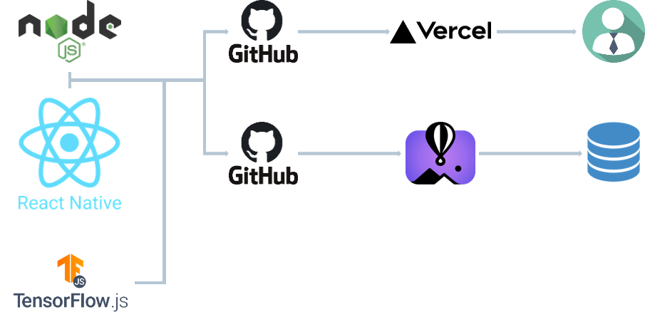

# CATCH MARKET

## Team Information

- This project has been built by Team 11.
- Team Members:
  - Jaewoo Kim (https://1124jaewookim.github.io)
  - Hojoon Lee (https://ihojun887.github.io)
  - Hyebin JIN (https://straybuilds.github.io)
  - Jey Kang (-)

## Problem Definition (250 words)

Advances in machine learning technology have revolutionized many fields, and the fashion industry is no exception. One such innovation is the emergence of a new web service that uses machine learning algorithms to identify photos of people wearing clothing or illustrations of fashion designs from uploaded images.

The premise of this service is both simple and ingenious. Users can upload a photo of a person wearing an outfit they find attractive or an illustration of a clothing design they envision. An underlying machine learning model, trained on a large dataset of fashion images and their associated metadata, analyzes the uploaded image. By identifying key features such as color, pattern, fabric, style, and cut, it matches clothing items in the image to similar items in the database.

However, the usefulness of this web service extends beyond simply identifying matching clothing items. Once the AI has made a selection, it provides the user with a direct link to an e-commerce website where they can purchase the matching or similar clothing item. This feature saves users the tedious process of searching through numerous online stores to find the item they want.

The service leverages the power of machine learning to bridge the gap between the fashion items you're looking for and the ones you'll actually buy. Whether it's discovering a great outfit from a stranger or bringing a creative fashion sketch to life, this web service can change the way people explore and experience fashion.

## System Design (500 words)

In our system, we differentiate between client pages and server pages. The client pages are implemented using REACT and NodeJS, and similarly, the server pages are also implemented using REACT and NodeJS as a base. The client pages do not have any internally stored data; instead, they communicate with the server pages to retrieve information, including banners and other data. The server serves as a database and accumulates the necessary information for the service. We deployed the client using a web service called Vercel and the database using another web service called Fly.io.

When the client page is executed, it automatically fetches the past product search information stored in the database and displays it in a photocard format. When a user wants to perform a new search, they enter the upload page, where the user provides information about the new product to search for (photo, user name, product title, price). This information is then uploaded to the server. Once the upload is complete, the client page returns to its initial state, and during the process of fetching the past product search information from the database, the recently searched results are also retrieved. Storing all the data on the server when performing a new search is done to allow other users to see all previous results when they access the client page. When a photocard is clicked on the main screen, the corresponding information opens in a new window. At the bottom of this window, there is a link to recommended products, which leads to the product purchase page.

The server has multiple roles, with the primary one being the database functionality. It uses SQLite to store new data in a row-based manner. When the client page sends new information through a POST request called "products," the server stores the product ID, name, price, search time, seller, image URL, and availability based on the provided information. To reduce the server's data load, images are not encoded as part of the request; instead, a static file folder is created, and the corresponding URL is used.

Furthermore, for each search request, the server determines which existing product in the database is most similar to each search product and generates a recommendation list. Initially, a pre-trained TensorFlow.js MobileNet model is used to determine the class (e.g., shirt, jeans) of each product. Then, among the products of the same class in the database, the one with the highest similarity is considered as the recommended result.

Initially, the plan was to incorporate Python for additional tasks. However, difficulties in deploying the server using AWS Lambda due to Docker Desktop issues and network limitations within the university led to exploring alternatives. Our site was deployed using external services like Vercel and Fly.io, making it impossible to communicate with the server PC using FASTAPI over an external network. Therefore, the intended implementation with Python for classifying products and using models like ResNet50 for feature extraction and similarity measurement using MSE or cosine similarity could not be realized. Additionally, with the availability of PyTorch, various additional functionalities were planned for implementation if needed.

## Machine Learning Component (300 words)

We use ML components to construct our recommendation API. If a consumer uploads an image similar to the clothes they want to buy on the website, our Catch Market encodes and classifies the image and displays similar images at the bottom of the web interface. As an encoder for our recommendation model, we select MobileNet. MobileNet is a convolutional neural network (CNN) architecture that is specifically designed for efficient mobile and embedded vision applications. With its affordable accuracy and low latency, it can be used effectively in recommendation systems for shopping websites. Below illustrate several strengths of the MobileNet for a recommendation API in a shopping website.

**Efficient and Lightweight:** MobileNet is known for its compact size and low computational requirements compared to other deep learning models. This is important for recommendation systems as they often need to process large amounts of data in real-time. MobileNet's efficiency allows for faster inference and lower resource consumption, making it suitable for deployment in web applications and mobile devices.

**Good Performance:** Despite its compact size, MobileNet still performs well in terms of accuracy. It achieves a good balance between model size and predictive performance. MobileNet's architecture is designed to extract meaningful features from images, which can be used to understand product attributes and user preferences in a shopping context.

**Real-time Recommendations:** MobileNet's efficiency allows for quick inference, enabling real-time recommendations in a shopping website. This is crucial as users expect fast and personalized recommendations while browsing through products. MobileNet can process images efficiently, extract relevant features, and provide recommendations promptly, enhancing the user experience.

Furthermore, between product class-based recommendation and feature-based recommendation, we chose class-based recommendation ML systems with careful consideration for two reasons. First, It can use domain specific knowledge of a certain class. Class-based recommendation API can leverage domain-specific knowledge and expertise to provide more accurate and relevant recommendations. By understanding the characteristics, attributes, and relationships within a product class, the API can make informed recommendations that align with users' interests. Second, Recommending items from the same product class allows users to discover new products within the categories they are interested in. Users might be looking for alternatives, variations, or complementary items related to a specific product class. By suggesting items from the same category, users can explore a wider range of options within their preferred domain.

## System Evaluation (500 words)

The key component of our system evaluation contains several steps. First, we sampled about 100 images from data crawled from several main shopping sites and used them as test images for the recommendation API. After the sampling step, the class of each image was organized in a table format by passing through the aforementioned MobileNet, which is the backbone of the recommendation model.

Then, our team members shared the outputs of the organized table, and manually verified whether the recommendation model correctly classified the images. By repeatedly performing this verification process, the database and our crawled data were refined with images that can be correctly classified by the model, which enabled us to provide a high-quality recommendation system.

Moreover, we also conducted a survey of potential consumers of our Catch Market to find out what their acceptable latency rate was. Using the two peer evaluation opportunities provided in the Data Engineering class, the opinions of about 15 users were collected, and the latency of the recommendation API that they found acceptable was about 3.4 seconds. By considering both the average latency consumers wanted and the latency provided by other benchmarked models, we select the backbone of our recommendation system.

Finally, we collected offline comprehensive feedback and evaluation of our systems from potential users. Since such evaluation plays a key role in determining user satisfaction with the web service, we thought this is the most important thing in our project. We actively gathered feedback from users through surveys and interviews and asked users about their satisfaction with the recommendations received, whether they found them helpful, and if they felt the recommendations were aligned with their preferences. Through the above user feedback and evaluation, we notice that they want at least one product displayed in the recommendation interface. Also, they want an actual website where they can buy the recommended products. Therefore, to reflect the opinions, the algorithm and the database of the shopping website were modified, and their needs could be satisfied.

## Application Demonstration (300 words)

Upon entering the website, at the top section, there is a banner that periodically updates, briefly providing instructions on how to use the site. To elaborate step by step, there is a button located on the upper-right corner labeled for uploading products. Clicking this button will redirect you to a dedicated product uploading page.

Now, you are on the product uploading page. Firstly, click on the section marked as number 1 to upload a file that is not in jpg format (for example, file formats like png or jpeg are acceptable). Once you have uploaded the image, you will need to fill in the fields numbered from 2 to 5. For the time being, only the image you uploaded in step 1 is used for product recommendations. Once all five fields have been completed, click the button to register the product. After registering, you will receive product recommendations.

Upon uploading the product, the main screen will display the search results as posts. By clicking on an individual post, you will be taken to a page that contains the details of the product. At the bottom of this page, you will see recommendations as an array for similar products that have been sourced from a database.

If you click on one of the recommended products, you will find a link to the actual shopping website where the product is listed, providing you the opportunity to make a purchase.

In the event that you proceed to buy the product, you will need to click on a button labeled 'Purchase'. After the purchase is completed, when you return to the main screen, the product will appear blurred. This blurring signifies that the product has already been purchased.

In addition to these instructions, for those who prefer a more visual guide or find it easier to follow along with a demonstration, we have thoughtfully prepared a step-by-step instructional video. This video will provide a hands-on walkthrough of the entire process, ensuring that users can seamlessly navigate through the product uploading and purchasing procedure. This is particularly beneficial for visual learners and those who wish to ensure they are utilizing the website to its fullest potential.

## Reflection (400 words)

Our efforts to compare clothing images based on specific classes have been reasonably successful. This success was particularly notable when dealing with items such as jeans, which were accurately categorized to a high degree. However, we found that the accuracy of our model was affected when the images included additional elements, such as backgrounds or people. This issue arose from the fact that many of the products within our database were represented solely by images of the clothing, devoid of any distracting elements. Consequently, these additional elements were interpreted as noise by our model, leading to a decrease in its predictive accuracy, which was an unfortunate shortcoming.

Our ambition had been to expand the functionality of our system to enable product recommendations based on hand-drawn sketches. However, we have identified that there was a lack of sufficient fine-tuning of our model in this specific aspect, which resulted in poor differentiation between sketches. This is an area we plan to improve in future iterations of the system.

While our current system is primarily based on classifying clothing, we have attempted to establish a connection with Python for the provision of more detailed and nuanced product recommendations. Regrettably, these attempts were hampered due to hardware limitations and challenges associated with our school's internal network, which resulted in our inability to fully implement the FASTAPI server and employ it in enhancing our system's performance.
We have also faced significant resource constraints, especially with regard to the availability of RAM. Our current use of a free website hosting service has imposed strict limitations on our resources. During the website development phase, we encountered numerous network errors attributed to these constraints. We managed to circumvent this problem temporarily on Demo Day by purchasing additional RAM to prevent errors. However, this is not a sustainable solution.

Given unlimited resources and time, we would prioritize the allocation of sufficient computational resources, including RAM and storage, to ensure the smooth operation of our website. We would also strive to establish a server that operates independently of the university's network. This would enable us to incorporate Python through a RESTful API, facilitating more effective communication, and allowing us to move beyond class-based recommendations by implementing a range of more sophisticated models.

We also recognize the potential benefit of using additional inputs, such as price, to refine our product recommendations. Currently, our website only uses image data to make recommendations. However, by utilizing more diverse inputs, we could deliver more detailed, personalized, and thus, more valuable recommendations to our users.
As the website continues to evolve, we envision the implementation of a user identification system, such as a login mechanism. Although the system currently does not differentiate between users and does not record any user-specific information, a login system could enable us to leverage user profiles as additional input. This would allow us to provide more personalized results tailored to individual users while ensuring the security and privacy of their search history.

## Broader Impacts (250 words)

The purpose of this web service is to help users identify and purchase similar clothing items based on uploaded images. It aims to streamline the shopping process by providing targeted recommendations and purchase links, as well as availability and out-of-stock status. In this respect, the system offers significant utility and convenience to fashion enthusiasts, designers, and shoppers alike.

However, as with any technological system, there is the potential for unintended use and associated harm. Users may abuse the service for counterfeiting purposes, copying unique designs without consent and infringing on copyrights and patents. There is also a risk of personal data being misused, as uploaded images may reveal sensitive information about the user, such as a person's face, fingerprints, background, and location information.

To mitigate these risks, teams can set up several options: First, they can add a checkbox to require users to obtain legal consent for public use when uploading images to the web service. Second, they can insert warnings within web pages to ensure that uploaded images are only used for their intended purpose and are not stored or shared. Finally, you can add a process to remove images with inappropriate or illegal content from the model training process.

To ensure that user data is kept safe and the system is used fairly, we will continue to monitor usage patterns and work to improve the security features of the Service. By prioritizing both technical efficiency and ethical considerations, we aim to provide a safe and user-friendly platform for discovering and exploring fashion.

**Deliverables**

Please find the following deliverables for our project:

1. Code, data, and associated materials used for the project:

   - Client : https://github.com/1124jaewookim/grab-market-client
   - Server : https://github.com/1124jaewookim/grab-market-server

2. Final Report:
   - https://github.com/1124jaewookim/grab-market-client/blob/main/README.md
